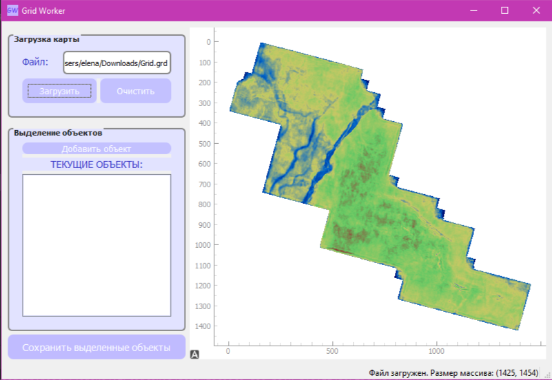
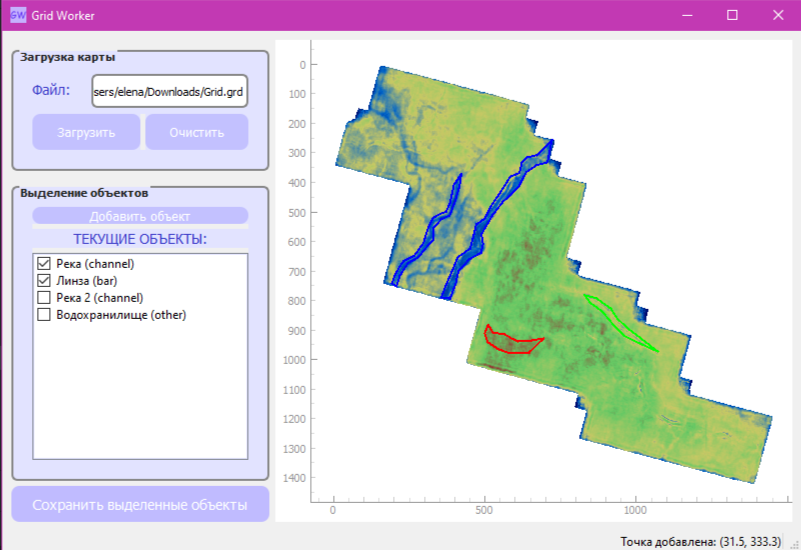
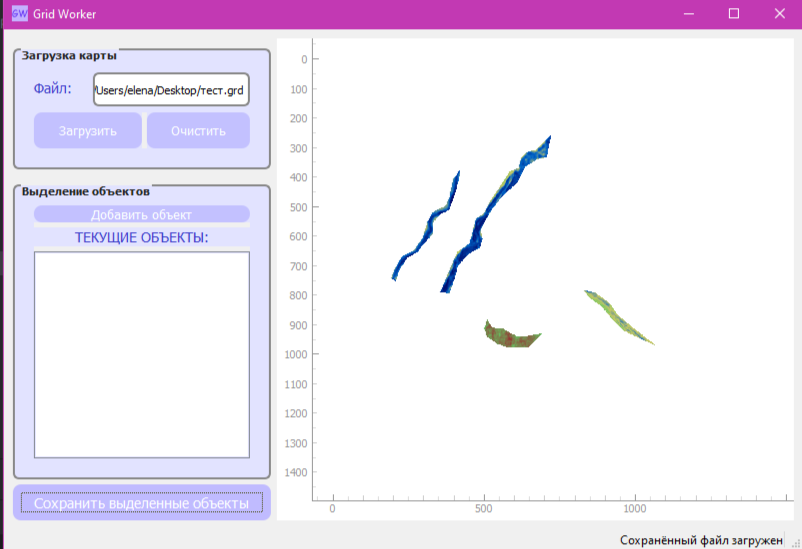

## Grid Worker

Grid Worker — инструмент для разметки геологических объектов на карте.
Поддерживает сохранение выделенных объектов и  автоматическое восстановление сессий.



## Возможности

- Загрузка GRD-файлов (формат Surfer)
- Интерактивное выделение полигонов на карте
- Присвоение имени и типа объектам (channel, bar, other)
- Удаление выбранных объектов
- Масштабирование карты
- Сохранение выделенных объектов в отдельный GRD-файл
- Автоматическое восстановление сессии при перезапуске

## Инструкция по установке и запуску приложения
1.  Скачайте и установите Python нужной версии (3.12 и выше) по ссылке: https://www.python.org/downloads/release/python-3120/
2. Скачайте PyCharm по ссылке: https://www.jetbrains.com/pycharm/
3. Войдите на GitHub (или сначала создайте свой аккаунт) через настройки PyCharm
и клонируйте ветку из репозитория. Для этого в терминале PyCharm прописать команды:   
```
# Клонируем конкретную ветку
git clone -b feature/Grid-Worker https://github.com/gasng/SeismicTools
                             ИЛИ
# Клонируем основной репозиторий 
git clone https://github.com/gasng/SeismicTools
# Переключаемся на нужную ветку
git checkout feature/Grid-Worker
```
4. Установите окружение poetry, для этого в терминале PyCharm прописать :
```
%LocalAppData%\Programs\Python\Python39\python.exe -m pip install poetry
```

Пункты 1-4 выполняются один раз при запуске программы на новом устройстве. 

Для последующей работы с приложением запустите файл main.py

## Использование
### Загрузка карты в формате .grd:
1) Нажмите "Загрузить"
2) В проводнике выберите GRD-файл
3) Карта отобразиться в главном окне
4) В случае загрузки нежелаемого файла нажмите "Очистить"
### Выделение объектов:
1) Нажмите "Добавить объект"
2) Кликайте по карте для добавления точек
3) Двойной клик - завершение полигона 
4) Введите имя и выберите тип объекта их предложенных, после этого объект появится в списке "ТЕКУЩИЕ ОБЪЕКТЫ"
### Управление объектами:
1) Отметьте объекты галочками в списке "ТЕКУЩИЕ ОБЪЕКТЫ"
2) Правый клик - "Удалить отмеченные"
3) Для экспорта выделенных полигонов используйте кнопку "Сохранить"
4) Просмотреть выделенные полигоны можно сразу после сохранения, выбрав "Yes" в диалоговом окне 
### Советы по использованию
- Увеличение/уменьшение изображения: колёсико мыши
- Точное выделение: увеличьте масштаб перед выделением
- Быстрое удаление: кликните по точке для удаления

### Пример использования и результатов работы 



## Структура проекта
    📁 SeismicTools/
    └─ 📁seismictools/  
        └─ 📁apps/
           └─ 📁GridWorker/
                📁 Calculate/
                    └─ 📁 Data/
                        └─ GridData.py
                        └─ ObjectList.py
                        └─ PoligonData.py
                        └─ PoligonMaska.py
                    └─ 📁 Reader/
                        └─ GrdReader.py
                    └─ 📁 Saver/
                        └─ PoligonSaver.py
                📁 Controller/
                    └─ WorkerReader.py
                    └─ WorkerSaver.py
                    └─ SessionManager.py
                📁 UI/
                    └─ 📁 Settings/
                        └─ SettingsWidget.py
                        └─ SettingsWidget.ui
                    └─ 📁 View/
                        └─ ViewWidget.py
                📁 Screenshots
                {} session.json
                   icon.ico
                📄 main.py
