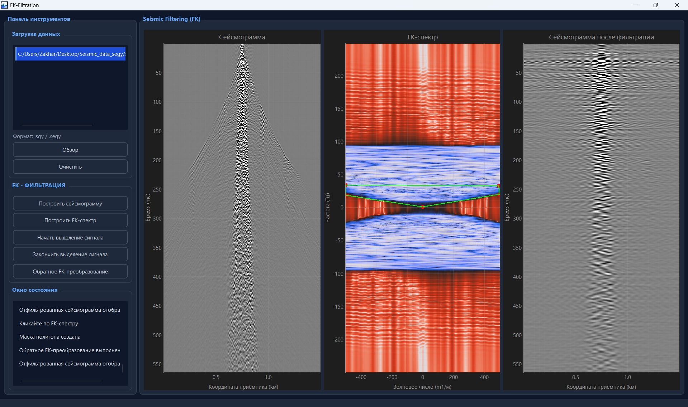

# FK-filtration

FK-filtration - инструмент фильтрации сейсмограмм при помощи выделения целевых волн на FK-спектре.

# Возможности
- Загрузка .sgy и .segy файлов
- Интерактивное выделение полигонов на карте
- Проведение FK-фильтрации сейсмограммы
- Отрисовка отфильтрованной сейсмограммы

# Инструкция по установке приложения
- Скачайте и установите Python нужной версии (3.12 и выше) по ссылке: https://www.python.org/downloads/release/python-3120/
- Скачайте PyCharm по ссылке: https://www.jetbrains.com/pycharm/
- Войдите на GitHub (или сначала создайте свой аккаунт) через настройки PyCharm
и клонируйте ветку из репозитория.
- Клонируем основной репозиторий 
git clone https://github.com/gasng/SeismicTools
- Переключаемся на нужную ветку
git checkout feature/Zakhar_FK_analysis
- Установите окружение poetry, для этого в терминале PyCharm прописать : %LocalAppData%\Programs\Python\Python39\python.exe -m pip install poetry

# Запуск окна приложения

1) Для работы с приложением нужно запустить файл main.py
2) Напишите в консоли: poetry run FK-filtration 

# Использование приложения 
- Нажмите кнопку "Обзор" и в проводнике выберете файл с расширением .sgy/.segy.
- Для того чтобы убрать файл из окна загрузки данных, выделите нужный файл и нажмите кнопку "Очистить"
- Чтобы построить сейсмограмму, нужно выбрать файл, а затем нажать на кнопку "Построить сейсмограмму". А также нажать на кнопку в левом нижнем углу графика отрисовки для масштабирования. (в дальнейшем будет исправлена эта проблема).
- Чтобы построить FK-спектр, нужно нажать на кнопку "Построить FK-спектр".
- Далее выделение полигона. Нажмите на кнопку "Начать выделение сигнала" и нажатиями по FK-спектру выделите полигон там, где хотите сделать обратное преобразование.
- Если случайно выделили не ту область, то нажав кнопку "Начать выделение сигнала" полигон сбросится и можно будет выделить заново.
- Далее нажмите на кнопку "Закончить выделение сигнала". После нажатия будет создана маска фильтра (внутри области 1, а снаружи 0).
- Если вы поставили меньше 3-х точек, то маска фильтра не будет создана и программа по умолчанию возьмет обратное преобразование от всего спектра.
- Нажатием на правую кнопку мыши удаляется последняя поставленная точка полигона.
- Нажмите на кнопку "Обратное FK-преобразование" чтобы получить отфильтрованную сейсмограмму.
- Для того чтобы отфильтровать другую сейсмограмму, нужно загрузить другой файл (обязательно выбрать его мышью!) и проделать такие же шаги.

# Пример использования приложения

